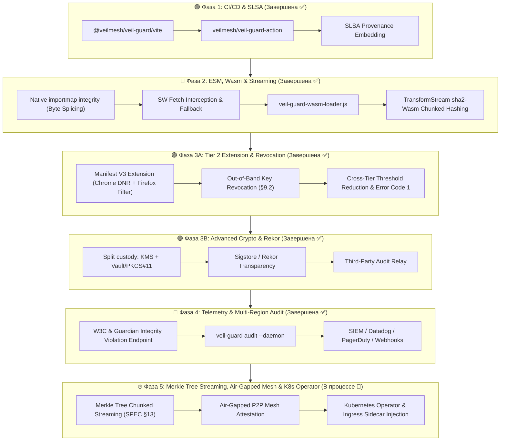

# Полная Спецификация и Дорожная Карта Проекта `veil-guard`

`veil-guard` — это Zero-Trust веб-комплекс аттестации и контроля целостности (Web Asset Integrity & Attestation Suite) для SPA, PWA и WebAssembly. Он приносит подписи уровня мобильных App Store / Google Play в веб-приложения без блокчейнов и тяжелых расширений.

> [!NOTE]
> Документ верифицирован на соответствие реальному исходному коду: [`manifest.rs`](src/manifest.rs), [`scanner.rs`](src/scanner.rs), [`main.rs`](src/main.rs), [`Cargo.toml`](Cargo.toml).

> [!IMPORTANT]
> **Предусловия Фазы 1.** Три вещи выяснились при попытке начать реализацию, и без них Блоки B–D не двигаются:
>
> 1. **Хранение ключей ≠ «положить в KMS».** AWS KMS и GCP KMS не подписывают Ed25519, а подписант обязан подписать под *каждым* алгоритмом корня (SPEC §8.1 шаг 3), иначе не считается в порог. Принятое решение — хранение **по алгоритму** (P-256 в KMS, Ed25519 в Vault transit или PKCS#11), нормативно зафиксировано в [SPEC.md §4.6](SPEC.md). Оба обходных пути (`sigalgs: ["p256"]` и выбрасывание приватной половины Ed25519) отвергнуты там же с обоснованием.
> 2. **Дистрибуция бинарника.** И npm-обёртка, и GitHub Action вызывают `veil-guard` из PATH. Релизный матричный билд живёт в [`.github/workflows/release.yml`](.github/workflows/release.yml) — на GitHub-зеркале, потому что у GitLab SaaS нет бесплатных macOS/Windows-раннеров. Канонический репозиторий остаётся на GitLab, его CI — [`.gitlab-ci.yml`](.gitlab-ci.yml).
> 3. **`closeBundle` не подходит для vite-ssg.** Хук срабатывает дважды и оба раза видит 1 HTML вместо 17 — vite-ssg рендерит страницы после завершения внутреннего `vite build`. Для SSG плагин обязан цепляться за `ssgOptions.onFinished`; `closeBundle` корректен только для обычного SPA.

---

## 1. Визуализация Дорожной Карты (Roadmap Diagram)




---

## 2. Критические технические риски и способы их решения

### ⚠️ Ограничения Manifest V3 в браузерах (Фаза 3)
* **Проблема:** API `declarativeNetRequest` предназначен для блокировки или перенаправления URL по статическим правилам, но он **не имеет доступа к телу ответа** (response body). Вычислить SHA-256 от загруженного `.js` файла до его попадания в DOM через `declarativeNetRequest` невозможно.
* **Решение:** Для расширения Tier 2 перехват первого визита реализуется через комбинированный подход:
  1. Перехват главного `index.html` на уровне HTTP-заголовков через `webRequest` (в Firefox/Safari и Chrome Enterprise) или подмена ответа через Service Worker расширения.
  2. Использование локального прокси-скрипта (**Injected Content Script**), который подменяет глобальный `document.write` / `appendChild` для `<script>` тегов до момента их исполнения, пока зарегистрированный `veil-guard-sw.js` не возьмет контроль на себя.

### ⚠️ Потоковая проверка в Service Worker (Фаза 2)
* **Проблема:** Браузерный API `crypto.subtle.digest('SHA-256', data)` не поддерживает потоковый ввод (Chunked Hashing) — он принимает только цельный `ArrayBuffer`.
* **Решение:** Для потоковой проверки через `TransformStream`:
  1. Компилировать нативную Rust-библиотеку **`sha2`** (уже используется в [`Cargo.toml`](Cargo.toml)) под `wasm32-unknown-unknown`, предоставляя методы `.update(chunk)` и `.finalize()`. Реализовано в [`wasm-hasher/`](wasm-hasher/). Это не единственный путь — чистый JS-SHA-256 по чанкам тоже не требует правок SPEC, — но самый быстрый.
  2. Альтернатива: разбивать крупные файлы (Wasm / бинарные чанки) на фиксированные блоки (например, по 1 МБ) с генерацией дерева Меркла (**Merkle Tree**) или массива хэшей блоков в манифесте. Требует расширения формата [`AssetEntry`](src/manifest.rs#L58-L65) и версионного bump SPEC.

  > [!WARNING]
  > Добавление `blake3` как алгоритма хэширования — это не drop-in замена. Требует: (1) явной зависимости в `Cargo.toml`, (2) нового значения `sigalg` в SPEC, (3) обновления conformance vectors. Приоритет — сначала `sha2`-Wasm.

> [!IMPORTANT]
> **Чему научила Фаза 2.** Весь потоковый путь — код, который падает молча: неверный дайджест, никаких исключений. Четыре дефекта прожили до ревью именно потому, что ни один тест их не касался.
>
> 1. **Встроенный Wasm был битым.** Константу `WASM_SHA256_B64` вставили руками, а не сгенерировали [`scripts/update-wasm-hasher.sh`](scripts/update-wasm-hasher.sh); модуль не компилировался, потоковый путь молча уходил в fallback. Теперь [`testdata/verify_wasm_hasher.mjs`](testdata/verify_wasm_hasher.mjs) инстанцирует модуль в CI, а [`run_sw_smoke.mjs`](testdata/run_sw_smoke.mjs) — ещё и из собранного бандла.
> 2. **JS-аллокатор выдавал всем один слот.** `_statePtr = 0` у каждого экземпляра: два параллельных стрима затирали друг друга, и один хешер возвращал дайджест чужого файла. Слоты теперь раздаются от `hasher_heap_base()` и переиспользуются.
> 3. **Чанк больше ~1 МиБ хешировался неверно.** Данные писались ниже вершины стека модуля, и `hasher_update` затирал их собственным кадром. Копирование идёт окнами по 64 КиБ выше `__heap_base`.
> 4. **Предполётная проверка выбрасывалась.** SW передавал `skipHashCheck`, которого `decideResponse` не знал; вердикт всегда был `BLOCK_TAMPER` и всегда игнорировался, унося с собой проверки размера и content-type. Разделено на `decideResponse` (по заголовкам) и `decideStreamedBody` (по телу).
>
> **Стриминг честнее описывать так.** Хеш проверяется в `flush`, то есть всегда в конце и детерминированно — «атакующий не угадает, на каком чанке» неверно. Спасает то, что скрипт, чья загрузка оборвалась, браузером не исполняется; код, читающий тело через `fetch`, ранние чанки уже увидел. Поэтому порог существует: ниже него буферизация сохраняет более сильную гарантию и кеш по дайджесту, и только тело, которое дорого держать целиком, получает более слабую. Ответ без `Content-Length` буферизуется — трактовать «неизвестно» как «большое» означало отправить в поток почти всё.

### ⚠️ Динамические импорты и Code Splitting (Фаза 1 → 2)
* **Проблема:** Автоматическое разбиение кода бандлерами (Vite/Webpack) создает взаимосвязанный граф ассетов. Изменение одного CSS-файла меняет хэши нескольких JS-чанков.
* **Решение:** Плагин [`vite-plugin-veil-guard`]() вызывает `veil-guard sign` против финального состояния `dist`, когда граф ассетов полностью записан на диск. Для обычного SPA это хук `closeBundle`.
* **Оговорка (проверено):** для **vite-ssg это неверно**. `closeBundle` срабатывает дважды — на клиентском и на SSR-билде — и оба раза в `dist` лежит 1 HTML-файл; 17 страниц рендерятся уже после. Плагин на этом хуке подписал бы огрызок, а 16 страниц уехали бы без SRI и без записей в манифесте. Для SSG точка входа — `ssgOptions.onFinished`. Плагин обязан определять режим и падать с внятной ошибкой, а не подписывать молча.

### ⚠️ Нативный importmap vs. враппер `window.veilGuardImport()` (Фаза 2)
* **Проблема:** Import Maps с атрибутом `integrity` — нативная функция браузера, а `window.veilGuardImport()` — кастомный JS-враппер. Смешение без чёткой стратегии создаёт двойной путь верификации.
* **Оговорка по версиям.** Chrome 111 и Firefox 108 — это версии, в которых появились **сами import maps**. Ключ `integrity` внутри них — отдельная и заметно более поздняя функция, и её поддержка не совпадает с поддержкой import maps ни в одном браузере. Практическое следствие: нативная проверка — не «приоритетный путь», а бонус там, где он есть; основным остаётся перехват `fetch` Service Worker'ом. Перед тем как закладываться на конкретные версии, сверяйтесь с caniuse, а не с этим документом.
* **Решение (стратегия приоритетов):**
  1. **Приоритет 1 (современные браузеры):** Генерировать `<script type="importmap">` с атрибутами `integrity` напрямую. Браузер проверяет SRI нативно без JS.
  2. **Приоритет 2 (legacy fallback):** `window.veilGuardImport(url)` перехватывает `import()` в среде, где `importmap integrity` не поддерживается, и проверяет хэш через Service Worker или Wasm-модуль.

---

## 3. Спецификация SLSA Provenance для манифеста `veil-guard` (Фаза 1)

Для интеграции с фреймворком **SLSA** (Supply-chain Levels for Software Artifacts) в манифест `veil-guard` добавляется блок `source` (уже предусмотрен как `serde_json::Value` в [`Manifest`](src/manifest.rs#L88)), расширенный метаданными происхождения сборки.

Файловая структура на диске после `veil-guard sign`:

| Файл | Содержимое |
|---|---|
| `dist/veil-guard-manifest.json` | JSON-манифест со списком ассетов и метаданными |
| `dist/veil-guard-manifest.sig` | Бинарный bundle подписей (`VGSIG1` формат, SPEC §5) |

Корректная структура [`veil-guard-manifest.json`](src/main.rs#L495) с блоком SLSA provenance:

```json
{
  "spec": "veil-guard/1",
  "version": 1754726400,
  "not_after": 1755331200,
  "sigalgs": ["ed25519", "p256"],
  "trust_root_id": "a1b2c3d4e5f6...",
  "trust_root": { "...": "..." },
  "scope": {
    "include": ["/"],
    "exclude": ["/api/"]
  },
  "source": {
    "commit": "7a9b2c8e1d3f4a5b6c7d8e9f0a1b2c3d4e5f6a7b",
    "toolchain": { "veil_guard": "0.1.0" },
    "slsa_provenance": {
      "builder": {
        "id": "https://github.com/veilmesh/veil-guard-action@v1"
      },
      "build_type": "https://slsa.dev/provenance/v1",
      "invocation": {
        "config_source": {
          "uri": "git+https://github.com/example/fintech-spa",
          "digest": {
            "sha256": "e3b0c44298fc1c149afbf4c8996fb92427ae41e4649b934ca495991b7852b855"
          },
          "entry_point": ".github/workflows/deploy.yml"
        },
        "environment": {
          "github_run_id": "123456789",
          "github_commit": "7a9b2c8e1d3f4a5b6c7d8e9f0a1b2c3d4e5f6a7b"
        }
      }
    }
  },
  "assets": [
    {
      "path": "/index.html",
      "sha256": "e3b0c44298fc1c149afbf4c8996fb92427ae41e4649b934ca495991b7852b855",
      "sha384": "38b060a751ac96384cd9327eb1b1e36a21fdb71114be07434c0cc7bf63f6e1da274edebfe76f65fbd51ad2f14898b95b",
      "size": 2048,
      "content_type": "text/html"
    },
    {
      "path": "/assets/app.js",
      "sha256": "a665a45920422f9d417e4867efdc4fb8a04a1f3fff1fa07e998e86f7f7a27ae3",
      "sha384": "59e1748777448c69de6b800d7a33bbfb9ff1b463e44354c3553bcdb9c666fa90125a3c79f90397bdf5f6a13de828684f",
      "size": 512000,
      "content_type": "text/javascript"
    }
  ]
}
```

> [!IMPORTANT]
> Блок `slsa_provenance` размещается **внутри существующего поля `source`** ([`Manifest.source: serde_json::Value`](src/manifest.rs#L88)), так как SPEC §12 разрешает дополнительные поля без версионного bump. Подписи хранятся в **отдельном** файле `veil-guard-manifest.sig` (бинарный `VGSIG1` bundle) и никогда не встраиваются в JSON.

> [!WARNING]
> **Это не SLSA-аттестация.** SPEC §1 прямо говорит: блок `source` — заявление подписанта, а не доказательство. Блоб, подписанный тем же ключом, что и артефакт, ничего не добавляет к доверию: настоящий SLSA — отдельная in-toto аттестация от билдера. Поле полезно как машиночитаемый след сборки, но называть его SLSA-совместимостью нельзя.
>
> Два следствия для реализации: `--provenance-json` обязан иметь потолок размера (манифест тянется Service Worker'ом при каждом холодном старте с `cache: 'no-store'`), и `audit` не должен трактовать содержимое блока как свидетельство. Порядок ключей в `source` определяется `serde_json` (BTreeMap, алфавит), а не порядком вставки: получится `commit`, `slsa_provenance`, `toolchain`.

---

## 4. Исправленный шаблон плагина `vite-plugin-veil-guard` (Фаза 1)

```typescript
// vite-plugin-veil-guard/src/index.ts
import { Plugin } from 'vite';
import { execFile } from 'child_process';
import { promisify } from 'util';

const execFileAsync = promisify(execFile);

export interface VeilGuardPluginOptions {
  /** Путь к файлу приватного ключа (.key.json) */
  keyPath: string | string[];
  /** Путь к файлу trust root (обязательный аргумент CLI --trust-root) */
  trustRootPath: string;
  /** Пути-префиксы, которые SW должен пропускать без проверки (напр. /api/) */
  exclude?: string[];
  /** Директория для генерации заголовков Nginx/Caddy/Netlify */
  headersOut?: string;
  /** Записать origin-коммит в поле source.commit */
  sourceCommit?: string;
}

export function veilGuardPlugin(options: VeilGuardPluginOptions): Plugin {
  let resolvedOutDir = 'dist';

  return {
    name: 'vite-plugin-veil-guard',
    apply: 'build',
    configResolved(config) {
      // Читаем финальный outDir после резолва всей конфигурации Vite
      resolvedOutDir = config.build.outDir || 'dist';
    },
    async closeBundle() {
      // closeBundle вызывается ПОСЛЕ того, как все файлы записаны на диск —
      // только в этот момент граф ассетов стабилен и хэши финальны.
      console.log('[veil-guard] Signing asset manifest...');
      try {
        const keys = Array.isArray(options.keyPath)
          ? options.keyPath
          : [options.keyPath];

        const args: string[] = [
          'sign',
          '--dist', resolvedOutDir,
          '--trust-root', options.trustRootPath,  // обязательный аргумент
        ];

        // Повторяем --key для каждого подписанта (k-of-n threshold)
        for (const key of keys) {
          args.push('--key', key);
        }

        if (options.exclude) {
          for (const pattern of options.exclude) {
            args.push('--exclude', pattern);
          }
        }

        if (options.headersOut) {
          args.push('--headers-out', options.headersOut);
        }

        if (options.sourceCommit) {
          args.push('--source-commit', options.sourceCommit);
        }

        const { stdout } = await execFileAsync('veil-guard', args);
        console.log(`[veil-guard] ✅ ${stdout.trim()}`);
      } catch (error) {
        console.error('[veil-guard] ❌ Build integrity signing failed:', error);
        throw error; // прерываем сборку при ошибке подписи
      }
    }
  };
}
```

**Пример использования в `vite.config.ts`:**
```typescript
import { defineConfig } from 'vite';
import { veilGuardPlugin } from 'vite-plugin-veil-guard';

export default defineConfig({
  plugins: [
    veilGuardPlugin({
      trustRootPath: './trust-root.json',
      keyPath: ['.keys/alice.key.json', '.keys/bob.key.json'],  // 2-of-3
      exclude: ['/api/', '/ws/'],
      headersOut: './headers',
      sourceCommit: process.env.GITHUB_SHA,
    }),
  ],
});
```

---

## 5. Полный 4-Фазный План Внедрения

### 🟢 Фаза 1: CI/CD & SLSA Provenance (Завершена ✅)
* [x] Выпуск npm-пакета `@veilmesh/veil-guard` (Node.js wrapper над CLI).
* [x] Реализация `vite-plugin-veil-guard` на хуке `closeBundle` с корректными CLI-аргументами (`--dist`, `--trust-root`, `--key`×N).
* [x] Слияние плагина и обертки в единый пакет с подпутём `@veilmesh/veil-guard/vite`.
* [x] Релиз `veilmesh/veil-guard-action` для GitHub Actions.
* [x] Расширение поля `source` в манифесте данными SLSA Provenance v1 (через `serde_json::Value`, без изменения SPEC).

### 🔵 Фаза 2: Dynamic ESM, Wasm & Streaming (Завершена ✅)
* [x] **Import Maps:** Нативный поиск `<script type="importmap">`, извлечение ESM-модулей и автоматическая инъекция `integrity` через байтовый сплайсинг (SPEC §10.1).
* [x] **Legacy Fallback:** Враппер `window.veilGuardImport(url)` для браузеров без поддержки `importmap integrity`.
* [x] **WebAssembly Attestation Loader:** `veil-guard-wasm-loader.js` с перехватом `WebAssembly.instantiateStreaming` и сверкой SHA-256.
* [x] **Chunked Hashing:** Потоковый Wasm-хешер `sha2` под `wasm32-unknown-unknown` для потоковой проверки в `TransformStream` Service Worker.

### 🟣 Фаза 3A: Tier 2 Extension & Out-of-Band Key Revocation (Завершена ✅)
* [x] **Browser Extension Manifest V3 (`veil-guard-ext`)**:
  - Chrome 111+ (`declarativeNetRequest` + Interstitial alert page + MAIN/ISOLATED world Guardian).
  - Firefox 128+ (`webRequestFilterResponse` для потоковой блокировки ответа на уровне сети браузера).
* [x] **Спецификация и вычисление Отзыва ключей (SPEC §9.2)**:
  - Wire Format `veil-guard/revocation/1`.
  - Арифметическое ограничение $k$-of-$n$: `revoked_keys.len() <= keys.len() - threshold` (возвращает `Reject` / CLI error code 1).
  - Сквозное вычитание отозванных ключей из порога во всех трех тирах: Tier 0 (`veil-guard verify` и `veil-guard audit`), Tier 1 (`veil-guard-sw.js`), Tier 2 Extension (`service-worker.js`).
* [x] **Кросс-языковые векторы отзыва**: Генерация в `testdata/gen_vectors.mjs` и полная проверка в `cargo test` (83 теста) и `npm test` расширения (11 проверок).

### 🟣 Фаза 3B: Advanced Crypto Infrastructure & Keyless Transparency (Завершена ✅)
* [x] **Split Custody (SPEC §4.6)**: Хранение ключей по алгоритму — P-256 в AWS/GCP KMS (`src/kms.rs`), Ed25519 в HashiCorp Vault transit engine (`src/vault.rs`). При указании `--vault-addr` и `--p256-public-der` в `KeyFile` не сохраняется ни один приватный байт.
* [x] **Sigstore / Rekor Transparency Log**: Загрузка хэша манифеста и подписи в Rekor (`src/rekor.rs` via `--rekor-upload`), фиксация metadata `source.rekor` (`log_index`, `integrated_time`, `log_id`, `entry_id`), и валидация в `veil-guard audit --rekor-verify`.
* [x] **Third-Party Audit Relay**: Команды `veil-guard relay push` и `pull` (`src/relay.rs`), серверное эталонное приложение `veil-guard-relay` (`relay-server/src/main.rs`), автоматический пуш из `veil-guard audit --relay-push` и межрегиональная проверка расхождений через `veil-guard diff`.


### 🔴 Фаза 4: Telemetry & Multi-Region Audit (Завершена ✅)
* [x] **W3C & Guardian Telemetry Server (`src/bin/veil-guard-telemetry.rs`)**: Эндпоинт приема отчетов W3C `IntegrityViolationReport` (`application/reports+json` и `application/csp-report`) и Guardian-телеметрии от Tier 1/2 с поддержкой `Bytes` экстрактора, CORS, лимитов тела и опциональной авторизацией.
* [x] **Continuous Daemon Audit Mode (`veil-guard audit --daemon`)**: Флаги `--daemon`, `--interval-secs <N>`, `--webhook-url <URL>`, `--webhook-format <FORMAT>` для непрерывного 24/7 аудита деплоев с `tokio::signal::ctrl_c()` и `MissedTickBehavior::Skip`.
* [x] **SIEM & Alerting Webhooks (`src/alerting.rs`)**: Неблокирующая отправка алертов через `reqwest` в формате Generic JSON, Slack (BlockKit), PagerDuty Events v2 и Datadog с пер-таргетной стейт-машиной (`OK` $\rightarrow$ `FAIL` $\rightarrow$ `RESOLVE`).


### 🔥 Фаза 5: Merkle Tree Streaming, Air-Gapped Mesh & K8s Operator (В процессе 🔄)
* [ ] **Merkle Tree Chunked Streaming (SPEC §13 & Rust Core)**:
  - Расширение структуры `AssetEntry` полем `merkle` (`chunk_size`, `leaf_hashes`, `root_hash`).
  - Генерация деревьев Меркла в `src/scanner.rs` для крупных ассетов (>5 МБ Wasm / AI моделей / CAD бинарников).
  - Потоковая верификация чанков в `veil-guard-wasm-loader.js` и `veil-guard-sw.js` с нулевой задержкой старта $O(1)$.
* [ ] **Air-Gapped P2P Mesh Attestation (VeilMesh Relay Integration)**:
  - Распространение и валидация подписанных манифестов через P2P рандеву (BLE / Wi-Fi Direct / Wi-Fi HaLow) при изолированной сети или сбоях централизованных CDN.
* [ ] **Kubernetes Operator & Ingress Auto-injection (B2B Enterprise)**:
  - Автоматическая подстановка CSP/SRI заголовков и регистрация сервисной аттестации на уровне Envoy/Traefik/Nginx Ingress без изменения исходного кода приложений.


